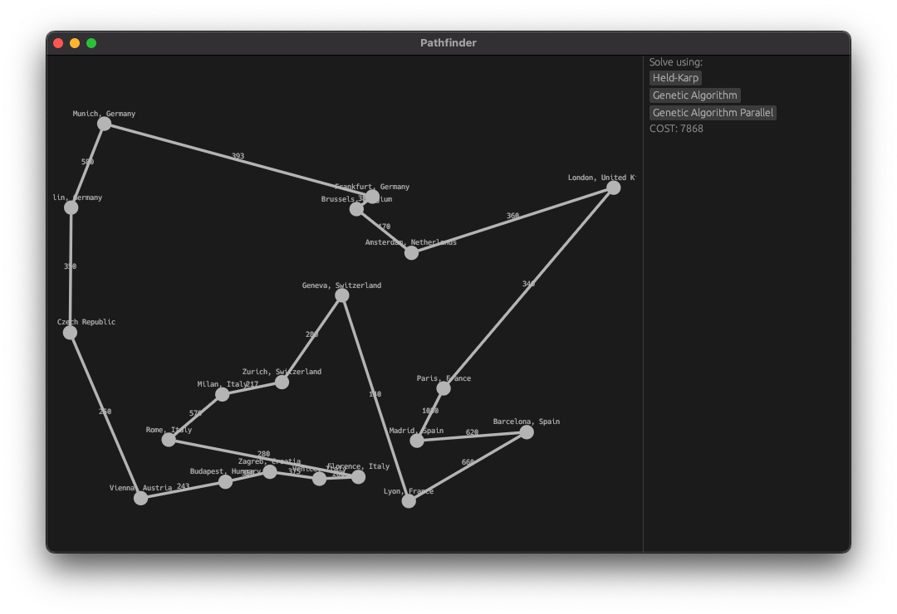

# European Cities Tour Planner (Traveling Salesman Problem)

## 📌 Project Description

In the TSP the input is a list of cities and the cost of traveling between each city.
The goal of the salesman is to determine the **shortest possible route**.

In this project the following algorithms are implemented:

- **Dynamic Programming (Held-Karp)**
- **Genetic Algorithm**
- **Parallel Genetic Algorithm**

Rayon was used as concurrency since it has a thread pool and allows us to create several more task than we have available threads.

---

## 📥 Input Data

The list of cities and the distances between them (in kilometers) are provided in a `.txt` file that accompanies this project.

---

## Instructions

Run the project with:

`cargo run --release`

---

## Results and comparisons

### DP solution

---

## Leftover TODO's

- [ ] Do not sort population but rather utilize a min-max heap to store the elitism values.
- [ ] Add configuration for GA.
- [ ] Try out different algorithms for selection instead of roulette wheel selection (ex. Tournament selection).
- [ ] Add circle layout

---
